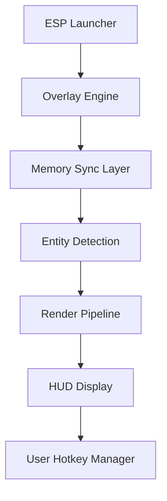

# DayZ ESP Tool – Total Awareness & Survival Vision 👁

See what others can’t with **DayZ ESP Tool**, a complete visual enhancement overlay for *DayZ Standalone*. Designed for players who crave tactical dominance, it reveals player locations, loot, vehicles, and wildlife in real time — all displayed through a clean, customizable 3D overlay.

Forget surprise ambushes and wasted searches — with ESP active, every movement, drop, and threat is within your sightline.

---

## 🧭 Overview

The **DayZ ESP Tool** transforms your screen into a tactical display — tracking every entity across Chernarus and Livonia. Using an external DirectX overlay, it operates fully outside the game memory, offering safe use even in online sessions.

With custom filters for players, items, and threats, you can adapt visibility to your exact survival goals.

> [!NOTE]
> ESP mode is 100% passive — no aimbot, no file modification, only visual awareness.

---

## ⚙️ Key Features

### 👁 Player ESP

* Draws outlines and skeletons through walls
* Displays health, distance, and equipped weapon
* Team color filters (green for friendly, red for enemy)
* Optional name tags and directional arrows

### 💰 Loot Radar

* Highlights lootable items with rarity color codes
* Custom filters: medical, ammo, tools, food, weapons
* Smart distance scaling to avoid screen clutter
* Shows supply crates and dropped gear up to 800m

### 🚗 Vehicle & Wildlife Tracking

* Identifies vehicles, boats, and animals
* Shows fuel and damage condition for vehicles
* Predictive movement trails for moving targets

### 🧭 Radar Mini-Map

* 2D overlay radar with zoom controls
* North indicator for orientation
* Filter toggles: *players*, *vehicles*, *items*

---

## 🪟 Compatibility

| Platform              | Supported | Notes                                      |
| --------------------- | --------- | ------------------------------------------ |
| **Windows 10 / 11**   | ✅         | Works in borderless or fullscreen windowed |
| **DayZ (Steam)**      | ✅         | Fully supported latest patch               |
| **Community Servers** | ✅         | All compatible                             |
| **Official Servers**  | ⚠️        | Overlay-only recommended                   |
| **GPU Support**       | ✅         | NVIDIA / AMD / Intel (DX11+)               |

> [!WARNING]
> For safety, disable any screen recording or capture overlay before running ESP to prevent system flagging.

---

## ⚡ Setup Instructions

1. **Download** `DayZ-ESP.zip`
2. **Extract** to a secure folder
3. **Run** `esp_loader.exe` as Administrator
4. **Launch DayZ**, then press `Insert` to enable overlay
5. Adjust filters and visuals using in-game hotkeys:

   * `F2`: Toggle Players
   * `F3`: Toggle Loot
   * `F4`: Toggle Vehicles
   * `F6`: Change color palette

Example startup command:

```bash
dayzesp.exe --players=on --loot=rare --vehicles=on --range=600
```

Save your custom setup:

```bash
dayzesp.exe --save-config="urban_scan.cfg"
```

---

## 🧩 System Diagram



---

## 🎨 Customization Options

| Setting        | Function               | Range / Options | Default |
| -------------- | ---------------------- | --------------- | ------- |
| `range`        | ESP detection distance | 100–1000m       | 500     |
| `colors`       | Outline colors         | HEX/RGB         | #00FF00 |
| `radar_size`   | Mini-map diameter (px) | 100–400         | 250     |
| `loot_filter`  | Item tier visibility   | 1–5             | 3       |
| `transparency` | Overlay opacity        | 0–100%          | 80%     |

> [!TIP]
> Use a darker transparency setting when playing at night to prevent visual noise.

---

## ❓ FAQ

**Q1: Does DayZ ESP affect FPS?**
Minimal performance impact (<3% CPU, <2% GPU). Optimized for smooth overlay rendering.

**Q2: Can it detect hidden or crouched players?**
Yes — outlines are visible regardless of stance, but visibility distance can be limited in configs.

**Q3: Is this compatible with reshade or night vision filters?**
Yes, the overlay is rendered separately and stacks above any shader effect.

**Q4: Can I save multiple profiles?**
Absolutely. Save as `.cfg` files and switch instantly using `Ctrl + [1–5]`.

**Q5: Is the tool safe on modded servers?**
Yes. Works with all modded maps and community hosts (non-protected).

---

## 🧠 Example Presets

**Base Defense (High Awareness)**

```cfg
players=on  
loot=off  
vehicles=on  
range=700  
colors=#FF0000
```

**Loot Run (Minimalist Setup)**

```cfg
players=off  
loot=rare  
vehicles=off  
range=500  
transparency=85
```

---

## 🚀 Final Thoughts

The **DayZ ESP Tool** is built for survivors who value information over luck. From spotting hidden campers to finding rare gear in massive zones, it transforms the battlefield into a grid of clarity and control.

Awareness isn’t cheating — it’s strategy perfected.
**See everything. Survive anything.**

---
